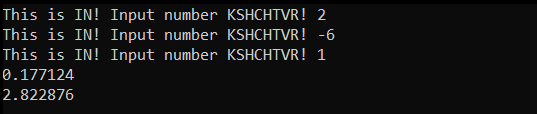
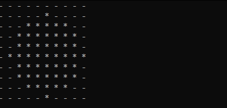

💥Dmit's Virtual Machine (DVM)💥
=========================
Description
--------------

This virtual machine is the part of System Programing course in MIPT. 
 DVM executes any programs that are represented on its bytecode. \
 For programming on DVM I created Dmit's ASM that translates ASM commands into their bytecodes.

 How It Works?
--------------
DVM can execute different commands with their unique bytecode.
Each command has its number. All commands has one byte size. The bytecode also depends on the arguments type: 

<image src="bytecode_expl.png" width = 700px>

### Examples
**#1: 0110 0011** \
Right four bytes of this command are 0011 => PUSH command has 3 number. \
Left four bytes of this command are 0110 => It has memory and register arg. \
This command is **PUSH [RAX]**. \
**#2: 0000 0101** \
 Right four bytes of this command are 0101 => ADD command has 5 num. \
Left four bytes of this command are 0000 => It has no args. \
This command is **ADD**. 
### Execution
After defining exact command by reading its byte code, DVM executes it.
## Dmit's Assembler
If you want to write programs, there is Dmit's Assembler for it.  Assembler translates commands into their bytecodes. There is a table that represent each command purpose and number:
| Command Num | Command Name |                                                           Purpose                                                          | Args Count |
|-------------|:------------:|:--------------------------------------------------------------------------------------------------------------------------:|:----------:|
|      0      |      IN      | Gets Num input from Command Line and then Pushes it on Stack                                                                 |      0     |
|      1      |      OUT     | Pop's Num from Stack and then displays it on screen                                                                        |      0     |
|      2      |   PUSH Imm   | Pushes Num on Stack                                                                                                        |      1     |
|      3      |   PUSH Reg   | Gets Num from Reg and then pushes it on Stack                                                                              |      1     |
|      3      |  PUSH [Imm]  | Pushes Num which is located in Memory on Imm adress                                                                        |      1     |
|      3      |  PUSH [Reg]  | Pushes Num which is located at Memory address stored in Reg                                                         |      1     |
|      4      |      DIV     | Gets two Nums from Stack and DIVIDES them, pushing result on Stack                                                     |      0     |
|      5      |      ADD     | Gets two Nums from Stack and SUMS them, pushing result on Stack                                                         |      0     |
|      6      |      SUB     | Gets two Nums from Stack and SUBTRACTS them, pushing result on Stack                                                  |      0     |
|      7      |      MUL     | Gets two Nums from Stack and MULTIPLIES  them, pushing result on Stack                                                  |      0     |
|      8      |      POW     | Gets two Nums from Stack and then RAISES one number to the POWER of a second, pushing result on Stack 
|      9      |      SIN     | Gets Num from Stack and then take it as an argument of SINE FUNCTION, pushing result on Stack                              |      0     |
|      10     |      COS     | Gets Num from Stack and then take it as an argument of COSINE FUNCTION, pushing result on Stack                            |      0     |
|      11     |     SQRT     | Gets Num from Stack and then take SQUARE ROOT of it, pushing result on Stack                                                |      0     |
|      12     |    POP Reg   | Gets Num from Stack and then puts it in Reg                                                                                |      1     |
|      12     |   POP [Imm]  | Gets Num from Stack and then puts it in  Memory, in imm address                                                            |      1     |
|      12     |   POP [Reg]  | Gets num from Stack and then puts it in Memory, at address stored in Reg                                                |      1     |
|      13     |   JMP label  | Moves IP from current position to label                                                                                    |      1     |
|      14     |   JA label   | Gets two Nums from Stack and then moves IP from current position to label, if first Num is GREATER then other Num          |      1     |
|      15     |   JB label   | Gets two Nums from Stack and then moves IP from current position to label, if first Num is LESS then other Num             |      1     |
|      16     |   JAE label  | Gets two Nums from Stack and then moves IP from current position to label, if first Num is GREATER OR EQUAL then other Num |      1     |
|      17     |   JBE label  | Gets two Nums from Stack and then moves IP from current position to label, if first Num is LESS OR EQUAL then other Num    |      1     |
|      18     |   JE label   | Gets two Nums from Stack and then moves IP from current position to label, if these two nums are EQUAl                     |      1     |
|      19     |   JNE label  | Gets two Nums from Stack and then moves IP from current position to label, if these two nums are NOT EQUAL                 |      1     |
|      20     |  CALL label  | Moves IP from current position to label offset and pushes OLD IP to Stack                                                         |      1     |
|      21    |      RET     | Gets Num from Stack and then moves IP from current position to that Num                                                    |      0     |
|      22     |     OUTC     | Gets Num from Stack and then displays symbol that matches this Num in ASCII table                                          |      0     |
|      23     |     DRAW     | Displays Memory on screen. If a non-zero value contains in this Memory Cell it displays '*', otherwise '.'            |      0     |
|      -1     |      HLT     | Exits Program                                                                                                              |      0     |

## Program Examples

<details>
<summary> Quadratic Equation Solver </summary>

### #1 Quadratic Equation Solver:

**Program Code:**

```
; RAX FOR a COEFF 
; RBX FOR b COEFF
; RCX FOR c COEFF
; RDX FOR Discriminant
; RDI FOR First Root
; RSI FOR Second Root
; RDIMAS FOR Number of Roots

CALL user_input
CALL solve_quadratic
CALL print_roots
HLT

user_input:
	IN
	IN
	IN
	POP RCX
	POP RBX
	POP RAX
	RET

print_no_roots:
	PUSH 79 ; O ASCII code
	PUSH 78 ; N ASCII code
	OUTC
	OUTC
	JMP print_roots_end

print_inf_roots:
	PUSH 70 ; F ASCII code
	PUSH 78 ; N ASCII code
	PUSH 73 ; I ASCII code
	OUTC
	OUTC
	OUTC
	JMP print_roots_end

print_one_root:
	PUSH RDI ; x1
	OUT
	JMP print_roots_end

print_two_roots:
	PUSH RDI ; x1 
	PUSH RSI ; x2
	OUT
	OUT
	JMP print_roots_end

print_roots:
	PUSH RDIMAS
	PUSH 0
	JE print_no_roots
	PUSH RDIMAS
	PUSH -1
	JE print_inf_roots
	PUSH RDIMAS
	PUSH 1
	JE print_one_root
	PUSH RDIMAS
	PUSH 2
	JE print_two_roots
	print_roots_end:
	RET

discr:
	PUSH 4
	PUSH RAX
	PUSH RCX
	MUL
	MUL
	PUSH RBX
	PUSH RBX
	MUL
	SUB
	POP RDX
	RET

inf_roots:
	PUSH -1 ; inf num of roots
	POP RDIMAS
	JMP solve_quadratic_end

no_roots:
	PUSH 0 ; no roots
	POP RDIMAS
	JMP solve_quadratic_end

b_coeff_zero:
	PUSH RCX
	PUSH 0
	JE inf_roots ; if c == 0
	JMP no_roots ; else

solve_linear:
	PUSH RBX
	PUSH 0
	JE b_coeff_zero ; if b == 0
	PUSH RBX
	PUSH RCX
	PUSH 0
	SUB
	DIV
	POP RDI
	PUSH 1 ; one root
	POP RDIMAS
	JMP solve_quadratic_end

discr_zero:
	PUSH 2
	PUSH RAX
	MUL
	PUSH RBX
	PUSH 0
	SUB
	DIV
	POP RDI
	PUSH 1 ; one_root
	POP RDIMAS
	JMP solve_quadratic_end

solve_quadratic:
	PUSH RAX
	PUSH 0
	JE solve_linear ; if a == 0
	CALL discr
	PUSH RDX
	PUSH 0
	JA no_roots ; if D < 0
	PUSH RDX
	PUSH 0
	JE discr_zero

	PUSH RAX
	PUSH 2
	MUL
	PUSH RDX
	SQRT
	PUSH RBX
	PUSH 0
	SUB
	ADD
	DIV
	POP RDI ; x1 = ...

	PUSH RAX
	PUSH 2
	MUL
	PUSH RDX
	SQRT
	PUSH RBX
	PUSH 0
	SUB
	SUB
	DIV
	POP RSI ; x2 = ...
	PUSH 2 ; two_roots
	POP RDIMAS
	solve_quadratic_end:
	RET
```

**Inputs && Outputs:**




</details>

<details>
<summary> Factorial Calculator </summary>

### #2 Factorial Calculator:
**Program Code:**
```
start:
	CALL user_input
	CALL factorial_count
	CALL output
	HLT

user_input:
	IN
	POP RAX
	RET

output:
	PUSH RAX
	OUT
	RET

factorial_count:
	PUSH RAX
	PUSH 1
	JE factorial_count_end ; induction base when 1!

	PUSH RAX
	PUSH 1
	PUSH RAX
	SUB
	POP RAX
	CALL factorial_count
	PUSH RAX
	MUL
	POP RAX

factorial_count_end:
	RET
```

**Inputs && Outputs:**


</details>

<details>

<summary> Circle Drawer </summary>

### #3 Circle Drawer:
**Program Code:**
```
CALL fill_bublic
	DRAW
	HLT

increase_height:
	PUSH 1
	PUSH RBX
	ADD
	POP RBX
	PUSH 0
	POP RAX
	JMP fill_cell_cycle

fill_bublic:

fill_cell_cycle:
	PUSH RBX
	PUSH 10
	JE fill_bublic_end
	PUSH RAX
	PUSH 10
	JE increase_height

	PUSH 5
	PUSH RAX
	SUB
	PUSH 5
	PUSH RAX
	SUB
	MUL ; (x-5)^2
	PUSH 5
	PUSH RBX
	SUB
	PUSH 5
	PUSH RBX
	SUB
	MUL ; (y-5)^2
	ADD ; (x-5)^2 + (y-5)^2
	PUSH 16
	JAE fill_cell ; (x-5)^2 + (y-5)^2 <= 16
	fill_cell_cycle_end:
	PUSH 1
	PUSH RAX
	ADD
	POP RAX
	JMP fill_cell_cycle

fill_bublic_end:
	RET

fill_cell:
	PUSH RAX
	PUSH RBX
	PUSH 10
	MUL
	ADD
	POP RCX
	PUSH 1
	POP [RCX]
	JMP fill_cell_cycle_end
```
**Output**



</details>

 **💘 Dmit DREC MIPT 2023**
