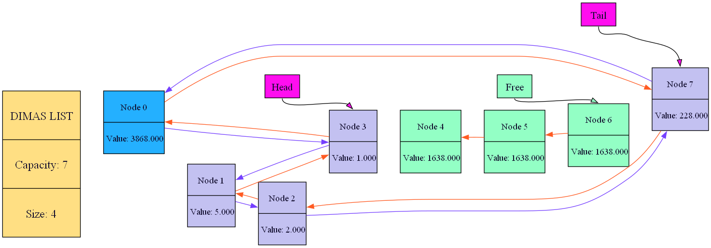

<h2> What is this? </h2>
<p>This is fastest list structure that you've ever seen. With graph visualisation!</p>

<h2> Why it is so fast? </h2>
<p>Because all operations in this structure does not depend on the list length. All operation like insert, erase have O(1) asymptotics.</p>

<h2> What about graphic visualisation? </h2>
<p>list has func ListGraphDump, that creates list_graph.gv file that you can compile in your bash with command:</p>
<p><b><i>"dot -T png list_graph.gv -o image_name.png".</i></b></p>
<p>And then you can open image_name.png and see your list visualisation!</p>

<h2> Example of work </h2>

```c++
#include "list.h"

int main()
{
	List list = {};
	
	ListCtor(&list);

	ListInsertAfter(&list, list.tail, 1);
	ListInsertAfter(&list, list.tail, 2);
	ListInsertAfter(&list, list.head, 4);
	ListRemove(&list, 1);
	ListInsertBefore(&list, list.tail, 5);
	ListInsertAfter(&list, list.tail, 228);

	ListGraphDump(&list);

	ListDtor(&list);

	return 0;
}
```
<h2> Example of Graph Dump </h2>


<p>Have fun!</p>
<h3> MIPT 2023 </h3>
