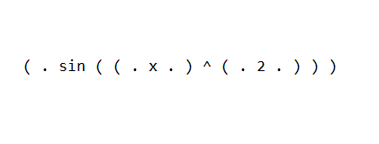
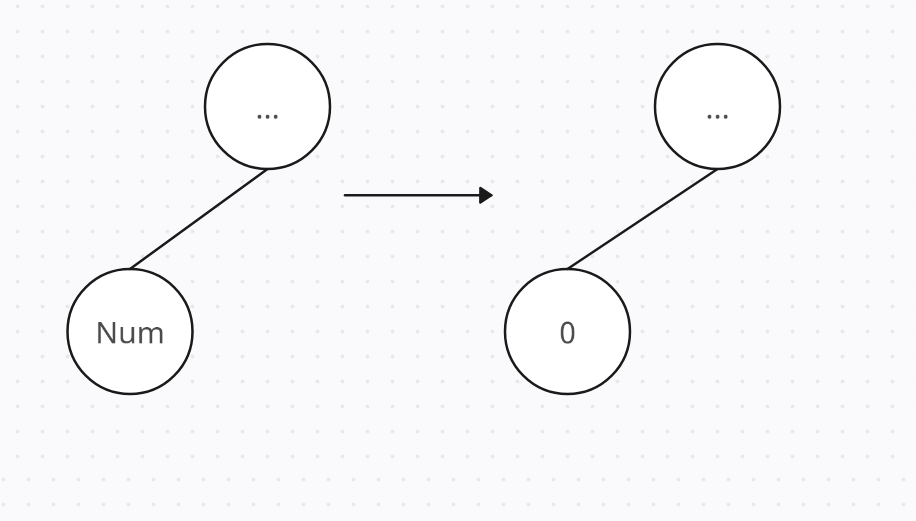
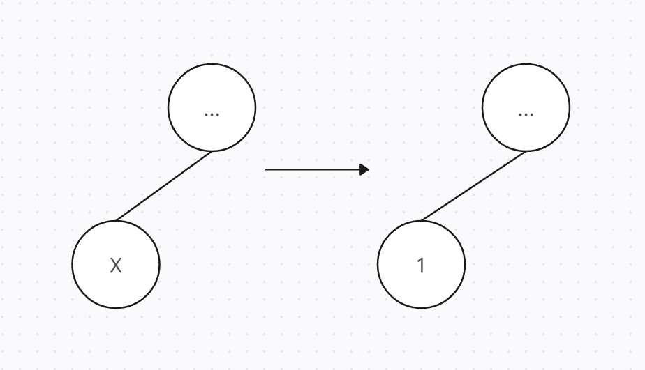
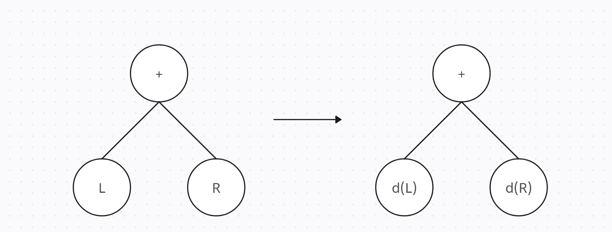
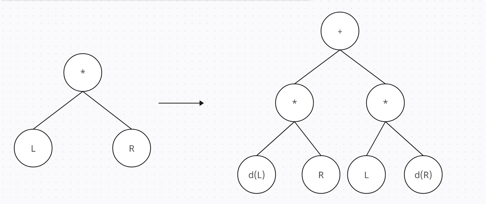
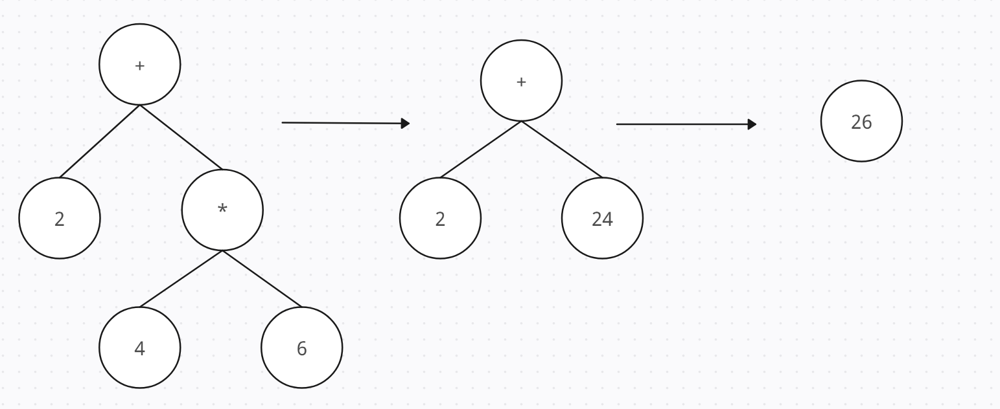
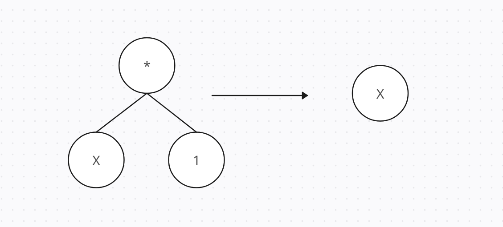
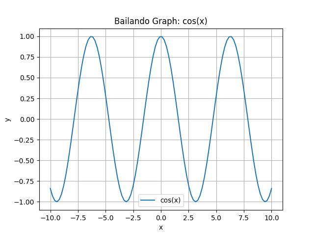
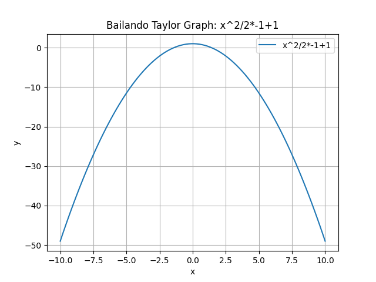
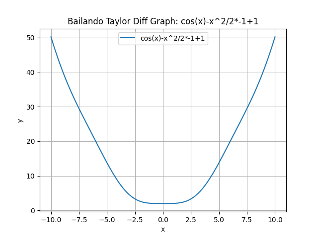

💥Bailando Differentiator💥
====
## Description
This differentiator is the part of System Programing Course in **MIPT**. 
It can differentiate any expressions.
## How it works?
### Input:
This program takes formatted tree string, that contains functions, numbers and variables. \
**Example of tree string:**



Then after the read of the tree, we are free to use our algorithm
### Algorithm:
The entire program is based on one recursive algorithm. Recursively transforming every node in the exact way we will get differentiated function tree in the end. So what are these transformations?
### Examples of transformation:
**Constant Transformation:**



**Variable Transformation:**



**Summary Transformation:**



**Multiply Transformation:**



### Optimizations: 
But by implementing this algorithm we will face a problem with overcomplicated expressions which we need to simplify.
To solve these issues we have different optimizations that will help us to make a good-looking result. \
**Constant Folding** \
If we have some sub-tree that consists only from constants we will calculate this tree and turn it into one constant node:



**Multiplying on One/Summing with Zero** \
If we have sub-tree with multiply on one/summing with zero nodes we can simply delete them:



## How to use it?
Firstly you need to initialize expression tree
```c
InitializeExprTree(&expr_tree, "source.txt");
```
After it you can use GetDifferentiatedTree function, and specify the variable by which you want to differentiate
```c
expr_tree = GetDifferentiatedTree(expr_tree, 'x');
```
If you want to use Optimizations (First and Second) you are free to use this function:
```c
OptimizeTree(&expr_tree);
```

## Another Features
**Python Graphs**
You can plot Tree Graph, by using function PlotTreeGraph, it will automatically generate .py file with graph and will open it.
```c
PlotTreeGraph(&expr_tree, "Graph");
```
**cos(x) output:**



**Taylor Series**
Also you can plot Taylor Series Graph, And Taylor Series and initial function subtract graph
```c
PlotTaylorTreeGraph(&expr_tree, "Taylor Graph", 'x', 3, 0);
PlotTaylorDiffGraph(&expr_tree, "Taylor Diff Graph", 'x', 3, 0);
```

**cos(x) output:**





### Latex Print
This program automatically save all your differentiating actions in LaTex file with Bailando explanations, so feel free to use it!

**Latex File Example:**


**💘 Dmit DREC MIPT 2023**
