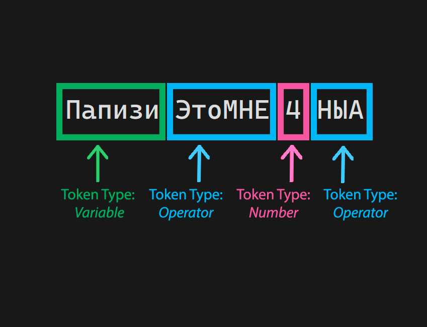
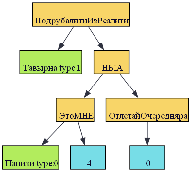
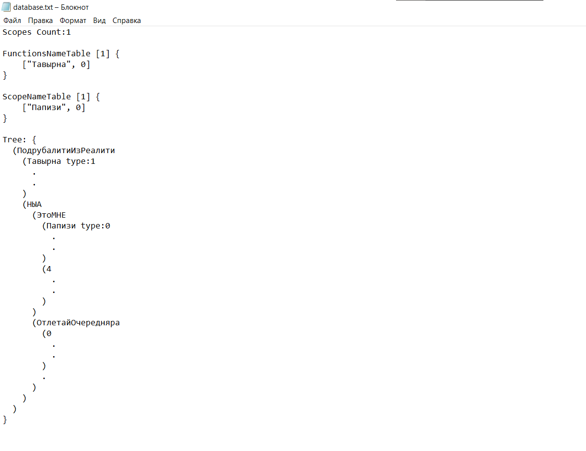
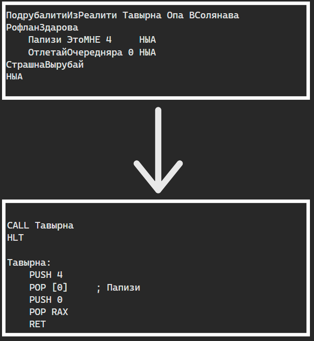
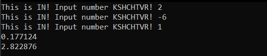
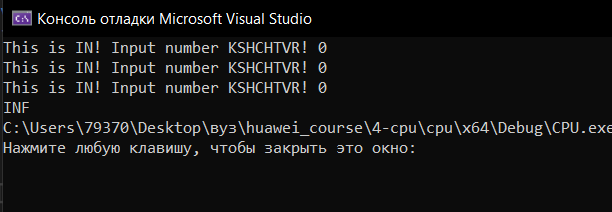
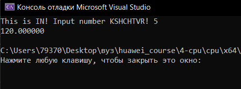
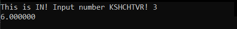

# 💥Papich Language 💥
## Description
This language is the part of C language, Data Structures and Compilers course in **MIPT**. On Papich language you can write any program because it is Turing Complete.
This language is inspired by famous video game streamer *Arthas*.


## How it works?
This program divides on four independent parts: **frontend**, **backend**, **assembler** and **CPU**. \
You can read about assembler and CPU parts on this link: https://github.com/dmjtsh/huawei_course/tree/main/4-cpu#readme.
### Frontend
**Recursive Decent algorithm** \
Entire frontend works on Recursive Decent algorithm. \
Firstly frontend divides program on tokens. This part of program is called **lexical analysis**:



After dividing program on tokens, we will use Recursive Decent algorithm that creates Scope Nametables and builds Code Tree from these tokens. \
**Example of Code Tree:**



We need to save this tree and nametables for backend transformations. For this there is a special format of .txt file, in which we save our information about program. \
**Example of database file:** 



### Backend
**Code Tree translating** \
The main idea of backend part is translating code tree into an assembler code. It recursively processes every node in exact way and in the end we will get our program fully translated into assembler code. \
**Example of transformation:**



### Commands in Papich Language

**Here is the list of all commands in Papich Language:** 


| **Num** |     **Operator**     |                                                                        **Description**                                                                        |                                                    **Syntax**                                                    |
|:-------:|:--------------------:|:-------------------------------------------------------------------------------------------------------------------------------------------------------------:|:----------------------------------------------------------------------------------------------------------------:|
|  **0**  | *                    | Binary arithmetic MULTIPLICATION operator. Returns result of multiplication.                                                                                  | *Num\|Var* * *Num\|Var*                                                                                              |
|  **1**  | /                    | Binary arithmetic DIVISION operator. Returns result of division.                                                                                              | *Num\|Var* / *Num\|Var*                                                                                              |
|  **2**  | ЛежатьПлюсСосать     | Binary arithmetic ADDITION operator. Returns result of addition.                                                                                              | *Num\|Var* ЛежатьПлюсСосать *Num\|Var*                                                                               |
|  **3**  | -                    | Binary arithmetic SUBTRACTION operator. Returns result of subtraction.                                                                                        | *Num\|Var* - *Num\|Var*                                                                                              |
|  **4**  | ПаунсВОкно           | Binary arithmetic EXPONENTIATION operator. Returns result of exponentiation.                                                                                  | *Num\|Var* ПаунсВОкно *Num\|Var*                                                                                     |
|  **5**  | БОЛЬШЕ               | Binary logical operator. Returns 1 if first operand is GREATER then second, otherwise returns 0.                                                              | *Num\|Var* БОЛЬШЕ *Num\|Var*                                                                                         |
|  **6**  | МАЛА                 | Binary logical operator. Returns 1 if first operand is LESS then second, otherwise returns 0.                                                                 | *Num\|Var* МАЛА *Num\|Var*                                                                                           |
|  **7**  | РЕАЛИСТИЧНА          | Binary logical operator. Returns 1 if first operand is EQUAL with second, otherwise returns 0.                                                                | *Num\|Var* РЕАЛИСТИЧНА *Num\|Var*                                                                                    |
|  **8**  | НЕРЕАЛИСТИЧНА        | Binary logical operator. Returns 1 if first operand is NOT EQUAL with second, otherwise returns 0.                                                            | *Num\|Var* НЕРЕАЛИСТИЧНА *Num\|Var*                                                                                  |
|  **9**  | И                    | Binary logical operator. Returns 1 if first operand is not equal 0 AND second operand is not equal 0 too,  otherwise returns 0.                               | *Num\|Var* И *Num\|Var*                                                                                              |
|  **10** | ИЛИ                  | Binary logical operator. Returns 1 if first operand is not equal 0 OR second operand is not equal 0,  otherwise returns 0.                                    | *Num\|Var* ИЛИ *Num\|Var*                                                                                            |
|  **11** | ДаДаЯПроверяй        | Condition Operator. If Expression is not equal 0 program executes sequence of operators enclosed in figured brackets.                                         | ДаДаЯПроверяй Опа *Expression* ВСолянава РофланЗдарова   *Sequence of Operators*   СтрашнаВырубай НЫА                |
|  **12** | ДобрыйПочанток       | Input operator. Puts user input from command line into the Variable.                                                                                          | ДобрыйПочанток Опа *Var* ВСолянава НЫА                                                                             |
|  **13** | НАНАНА               | Output operator. Puts ASCII code that contains in Variable into the command line.                                                                             | НАНАНА Опа *Var* ВСолянава НЫА                                                                                     |
|  **14** | ОпаФКу               | Output operator. Puts Number that contains in Variable into the command line.                                                                                 | ОпаФКу Опа *Var* ВСолянава НЫА                                                                                     |
|  **15** | ЛучшийВМиреЗаРаботой | Cycle Operator. While Expression is not equal 0 program performs executes of operators enclosed in figured brackets.                                          | ЛучшийВМиреЗаРаботой Опа *Expression* ВСолянава РофланЗдарова     *Sequence of Operators* СтрашнаВырубай НЫА         |
|  **16** | ЭтоМНЕ               | Assignment Operator. Puts Expression into the Variable.                                                                                                       | *Var* ЭтоМНЕ *Expression* НЫА                                                                                        |
|  **17** | НЫА                  | Operators sepator.                                                                                                                                            | *Operator* НЫА                                                                                                     |
|  **18** | ПодрубалитиИзРеалити | Function Operator. Creates function, with some name and with any number of arguments. If called executes sequence of operators enclosed in figured brackets.  | ```ПодрубалитиИзРеалити *FuncName* Опа *FuncArgs* ВСолянава  РофланЗдарова *Sequence of Operators* СтрашнаВырубай  НЫА```  |
|  **19** | ХАХАХА               | Function arguments separator.                                                                                                                                 | ПодрубалитиИзРеалити *FuncName* Опа *Arg1* ХАХАХА *Arg2* ХАХАХА ... *ArgN* ВСолянава                                     |
|  **20** | Опа                  | Open Bracket.                                                                                                                                                 | Опа *Expression* ВСолянава                                                                                         |
|  **21** | ВСолянава            | Close Bracket.                                                                                                                                                | Опа *Expression* ВСолянава                                                                                         |
|  **22** | РофланЗдарова        | Open Figure Bracket.                                                                                                                                          | РофланЗдарова     *Sequence of Operators* СтрашнаВырубай НЫА                                                       |
|  **23** | СтрашнаВырубай       | Close Figure Bracket.                                                                                                                                         | РофланЗдарова     *Sequence of Operators* СтрашнаВырубай НЫА                                                       |
|  **24** | ОтлетайОчередянра    | Return Operator. Returns Num\|Var from function and exites it.                                                                                                | ОтлетайОчередняра *Num\|Var* НЫА                                                                                   |
### Examples of Programms in Papich Language
**#1 Quadratic equation solver:** 
```
ПодрубалитиИзРеалити ПосчитайДискриминат Опа А ХАХАХА Б ХАХАХА С ВСолянава
РофланЗдарова
	Д ЭтоМНЕ Б ПаунсВОкно 2 - 4 * А * С НЫА

	ОтлетайОчередняра Д НЫА
СтрашнаВырубай
НЫА

ПодрубалитиИзРеалити РешиЛинейноеУравнение Опа Б ХАХАХА С ВСолянава
РофланЗдарова
	х0 ЭтоМНЕ Опа 0-С ВСолянава / Б НЫА 
	
	ОтлетайОчередняра х0 НЫА
СтрашнаВырубай
НЫА

ПодрубалитиИзРеалити ПосчитайОдинКорень Опа А ХАХАХА Б ВСолянава
РофланЗдарова
	х0 ЭтоМНЕ Опа 0 - Б ВСолянава / Опа 2 * А ВСолянава НЫА	

	ОтлетайОчередняра х0 НЫА
СтрашнаВырубай
НЫА

ПодрубалитиИзРеалити ПосчитайПервыйКорень Опа А ХАХАХА Б ХАХАХА Д ВСолянава
РофланЗдарова
	х1 ЭтоМНЕ Опа 0 - Б ЛежатьПлюсСосать Д ПаунсВОкно 0.5 ВСолянава / Опа 2 * А ВСолянава НЫА

	ОтлетайОчередняра х1 НЫА
СтрашнаВырубай
НЫА

ПодрубалитиИзРеалити ПосчитайВторойКорень Опа А ХАХАХА Б ХАХАХА Д ВСолянава
РофланЗдарова
	х1 ЭтоМНЕ Опа 0 - Б - Д ПаунсВОкно 0.5 ВСолянава / Опа 2 * А ВСолянава НЫА

	ОтлетайОчередняра х1 НЫА
СтрашнаВырубай
НЫА

ПодрубалитиИзРеалити ВыведиОдинКорень Опа х0 ВСолянава
РофланЗдарова
	ОпаФКу Опа х0 ВСолянава НЫА

	ОтлетайОчередняра 0 НЫА
СтрашнаВырубай
НЫА

ПодрубалитиИзРеалити ВыведиБесконечноКорней Опа ВСолянава
РофланЗдарова
	Дядя ЭтоМНЕ 73 НЫА
	Не   ЭтоМНЕ 78 НЫА
	Надо ЭтоМНЕ 70 НЫА
	НАНАНА Опа Дядя ВСолянава НЫА
	НАНАНА Опа Не   ВСолянава НЫА
	НАНАНА Опа Надо ВСолянава НЫА

	ОтлетайОчередняра 0 НЫА
СтрашнаВырубай
НЫА

ПодрубалитиИзРеалити ВыведиНетКорней Опа ВСолянава
РофланЗдарова
	Кто     ЭтоМНЕ 78 НЫА
	Мяукает ЭтоМНЕ 79 НЫА
	НАНАНА Опа Кто     ВСолянава НЫА
	НАНАНА Опа Мяукает ВСолянава НЫА

	ОтлетайОчередняра 0 НЫА
СтрашнаВырубай
НЫА

ПодрубалитиИзРеалити Тавырна Опа ВСолянава
РофланЗдарова
	А  ЭтоМНЕ 0 НЫА
	Б  ЭтоМНЕ 0 НЫА
	С  ЭтоМНЕ 0 НЫА

	ВозврЗнач ЭтоМНЕ 0 НЫА

	ДобрыйПочанток Опа А ВСолянава НЫА
	ДобрыйПочанток Опа Б ВСолянава НЫА
	ДобрыйПочанток Опа С ВСолянава НЫА
	
	ДаДаЯПроверяй Опа Опа А РЕАЛИСТИЧНА 0 ВСолянава И Опа Б РЕАЛИСТИЧНА 0 ВСолянава И Опа С РЕАЛИСТИЧНА 0 ВСолянава ВСолянава
	РофланЗдарова
		ВозврЗнач ЭтоМНЕ ВыведиБесконечноКорней Опа ВСолянава НЫА

		ОтлетайОчередняра 0 НЫА
	СтрашнаВырубай
	НЫА

	ДаДаЯПроверяй Опа А РЕАЛИСТИЧНА 0 ВСолянава
	РофланЗдарова
		х0 ЭтоМНЕ РешиЛинейноеУравнение Опа Б ХАХАХА С ВСолянава НЫА
		
		ВозврЗнач ЭтоМНЕ ВыведиОдинКорень Опа х0 ВСолянава НЫА
	
		ОтлетайОчередняра 0 НЫА
	СтрашнаВырубай
	НЫА

	Д ЭтоМНЕ ПосчитайДискриминат Опа А ХАХАХА Б ХАХАХА С ВСолянава НЫА

	ДаДаЯПроверяй Опа Д МАЛА 0 ВСолянава
	РофланЗдарова
		ВозврЗнач ЭтоМНЕ ВыведиНетКорней Опа ВСолянава НЫА

		ОтлетайОчередняра 0 НЫА
	СтрашнаВырубай
	НЫА
	
	ДаДаЯПроверяй Опа Д РЕАЛИСТИЧНА 0 ВСолянава
	РофланЗдарова
		х0 ЭтоМНЕ ПосчитайОдинКорень Опа А ХАХАХА Б ВСолянава НЫА
		ВозврЗнач ЭтоМНЕ ВыведиОдинКорень Опа х0 ВСолянава НЫА

		ОтлетайОчередняра 0 НЫА
	СтрашнаВырубай
	НЫА

	ДаДаЯПроверяй Опа Д БОЛЬШЕ 0 ВСолянава
	РофланЗдарова
		х1 ЭтоМНЕ ПосчитайПервыйКорень Опа А ХАХАХА Б ХАХАХА Д ВСолянава НЫА
		х2 ЭтоМНЕ ПосчитайВторойКорень Опа А ХАХАХА Б ХАХАХА Д ВСолянава НЫА

		ВозврЗнач ЭтоМНЕ ВыведиОдинКорень Опа х1 ВСолянава НЫА
		ВозврЗнач ЭтоМНЕ ВыведиОдинКорень Опа х2 ВСолянава НЫА

		ОтлетайОчередняра 0 НЫА
	СтрашнаВырубай
	НЫА	
	
	ОтлетайОчередняра 0 НЫА

СтрашнаВырубай
НЫА
```

**Inputs & Outputs:**





**#2 Factorial Calculator:** 
```
ПодрубалитиИзРеалити БезТильта Опа НольОшибок ВСолянава
РофланЗдарова
	ДаДаЯПроверяй Опа НольОшибок РЕАЛИСТИЧНА 1 ВСолянава
	РофланЗдарова
		ОтлетайОчередняра 1 НЫА
	СтрашнаВырубай
	НЫА

	ХелпДауны ЭтоМНЕ НольОшибок - 1 НЫА
	ИзиКатка  ЭтоМНЕ БезТильта Опа ХелпДауны ВСолянава НЫА
	Гыыыы     ЭтоМНЕ НольОшибок * ИзиКатка НЫА
	
	ОтлетайОчередняра Гыыыы НЫА
СтрашнаВырубай
НЫА

ПодрубалитиИзРеалити Тавырна Опа ВСолянава
РофланЗдарова
	НольОшибок ЭтоМНЕ 0 НЫА
	КтоМяукает ЭтоМНЕ 0 НЫА
	
	ДобрыйПочанток Опа НольОшибок ВСолянава НЫА

	КтоМяукает ЭтоМНЕ БезТильта Опа НольОшибок ВСолянава НЫА
	
	ОпаФКу Опа КтоМяукает ВСолянава НЫА
	
	ОтлетайОчередняра 0 НЫА
СтрашнаВырубай
НЫА
```
**Inputs & Outputs:**





**💘 Dmit DREC MIPT 2023**
